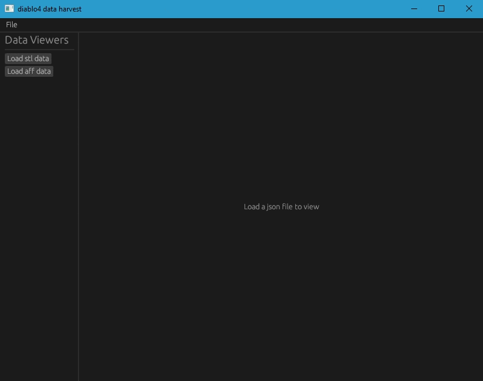

## About

Rust rewrite of [diablo4-string-parser](https://github.com/alkhdaniel/diablo-4-string-parser)

Currently supports:
`.stl`
`.aff`
`.skl`

Drag a folder of files over the binary.

## UI

Update: added skl file support.

You can use the ui to select a folder to parse by clicking `file` in the top left of the window.

You can still drag a folder over the binary.

#

